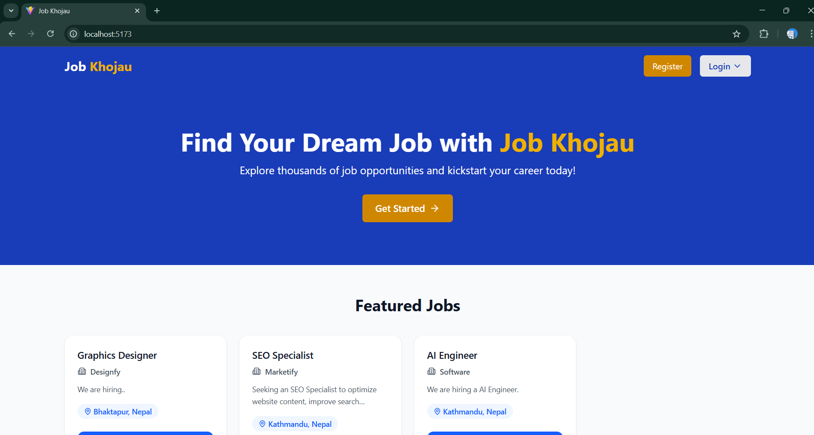
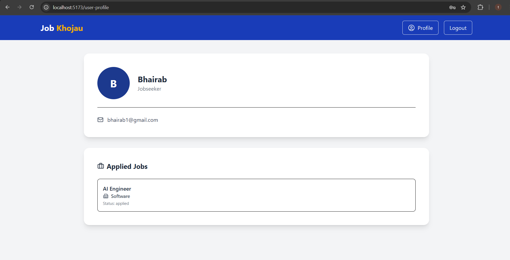
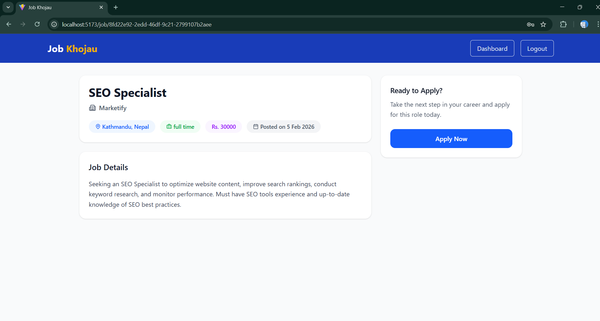
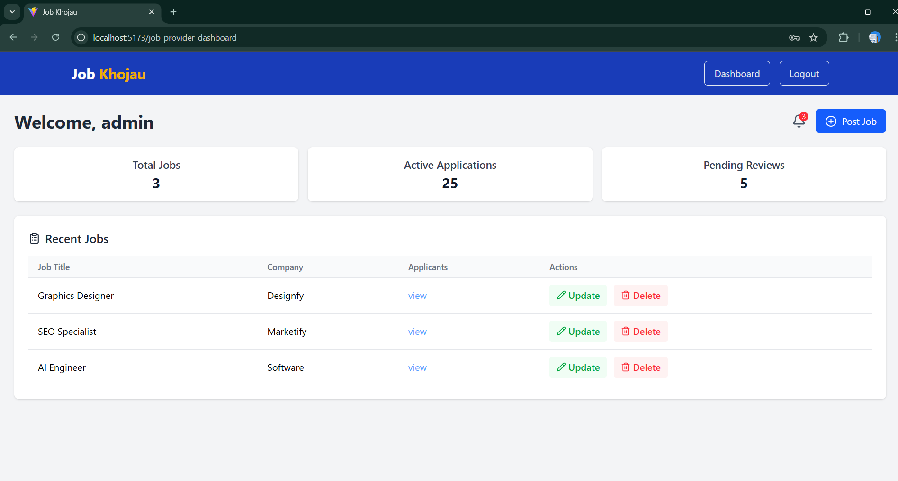
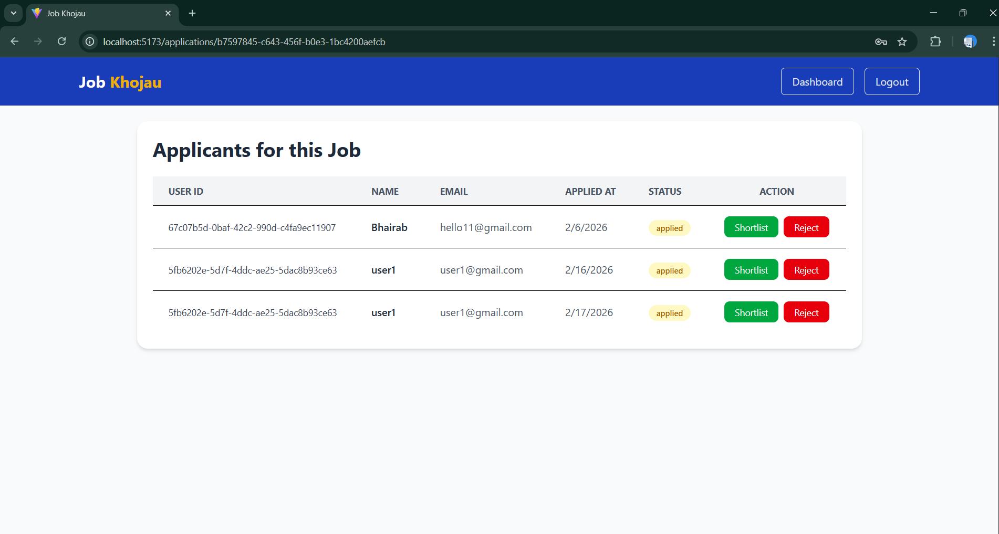

# Job Portal Web Application

A full-stack **Job Portal Web Application** built with **React.js**, **Tailwind CSS**, and **Redux Toolkit** on the frontend, and **Node.js**, **Express.js**, and **PostgreSQL** (with **Sequelize ORM**) on the backend. This platform allows job seekers to browse and apply for jobs, while employer can post, manage, and shortlist candidates.

---

## 🚀 Features

### For Job Seekers
- Create user profile
- Browse for jobs
- Apply to jobs directly through the portal
- View applied jobs history

### For Employer
- Post new job listings
- View applications and candidate details
- Shortlist or reject candidates

### General
- Responsive UI built with **Tailwind CSS**
- State management with **Redux Toolkit**
- JWT authentication and secure login/logout
- Email notifications (OTP verification, password reset)

---

## 🛠 Tech Stack

### Frontend
- **React.js** – Component-based UI
- **Tailwind CSS** – Styling and responsive design
- **Redux Toolkit** – State management
- **React Router DOM** – Navigation
- **Axios** – HTTP requests
- **React-Toastify** – Notifications

### Backend
- **Node.js** & **Express.js** – RESTful API
- **PostgreSQL** – Relational database
- **Sequelize ORM** – Database modeling and queries
- **bcrypt** – Password hashing
- **jsonwebtoken (JWT)** – Authentication
- **Nodemailer** – Email services

## 📸 Screenshots

> Store your screenshots in `screenshots/` folder inside the main project directory.

### Home Page

### Job Listings

### User Profile

### Job View

### Job Provider Dashboard

### Applicants List

## Future Enhancements

- Real-time chat between employers and job seekers
- Advanced filtering and job recommendation system
- Resume upload feature
- Payment gateway for premium job postings

